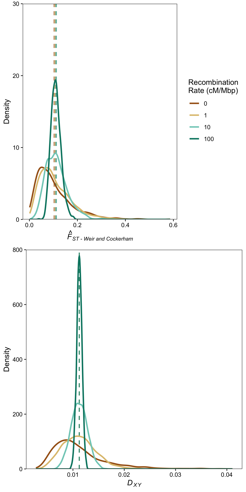

# Coalescent Simulations

**Note that ```planeScript.py``` involves hard-coding parameters of interest and sample sizes, so be careful when using it!**

In the MS we present results for an island model, but we explored other models too. The list below gives info on the models simulated. 

* Island Model - 100 demes with symmetric migration
* 1-dimensional cline - 100 demes with migration limited to nearest neighbours
* 1-dimensional ring - The same as the cline, except that the ends join up
* Isolation/Migration - 2 demes that exchange migrants at equal rates

The script entitled planeScript.py is a python3 script that implements the msprime simulations and analysis of the data described in the paper. It takes a while to run if you do lots of reps.

It is called ```planeScript.py``` because I wrote most of it on a plane.

The ```planeScript.py``` script calculates *F<sub>ST</sub>*, the standard error of *F<sub>ST</sub>*, *D<sub>XY</sub>* and extracts the number of coalescent trees from the 10,000bp sequence simulated and writes it all to a CSV file for ease of plotting in R.


The script [plotHistograms.R](plotHistograms.R) plots the results of the coalescent simulations.



