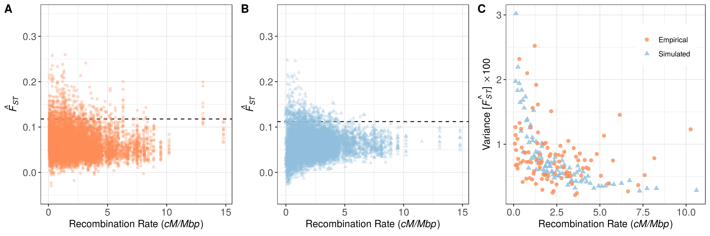

# Analysis of simulated and empirical *Drosophila melanogaster* datasets

This directory contains the scripts and analysis files that were used to generate the results shown in Figure 2


The script [bin/plotDrosophila_plusSimulations.R](bin/plotDrosophila_plusSimulations.R) contains the code to do all the statistical analyses and the plotting for this part of the paper. 

Below I demonstrate the code used to generate the simulated data and to analyse the empirical data.


# Simulated data

I used *stdpopsim* to model the entire *D. melanogaster* genome incorporating the recombination rate variation estimated by Comeron et al (2012).

I used the script [run_2Pop_simulations.py](bin/run_2Pop_simulations.py) to run the genome simualtions. Using *stdpopsim* was really fun and I'll definitely make use of it in the future, look how easy it is to simulate chromosome 2L:

```python
import stdpopsim,sys

## I would like to simulate Drosophila melanogaster please
species = stdpopsim.get_species("DroMel")
## I have specified the desired chromosome arm at the command line, let's 
contig = species.get_contig("chr2L", genetic_map = "ComeronCrossover_dm6")

## For testing, it is good to model a lil chunk of chromosome
#contig = species.get_contig("chr2L", length_multiplier = 0.10)

## You can grab the genetic map out of the simulations using:
#for p, r in zip( contig.recombination_map.get_positions() , contig.recombination_map.get_rates() ):
#	print( p , r )

Ne = species.population_size/10

model = stdpopsim.IsolationWithMigration(2*Ne, Ne, Ne, Ne, 1.5/Ne, 1.5/Ne)

print("NA", "N1", "N2", "T", "M12", "M21")
print( 2*Ne, Ne, Ne, Ne, 1.5/Ne, 1.5/Ne)

## I want to simulate 20 samples from each population
samples = model.get_samples(20,20)

## I will simulate using msprime
engine = stdpopsim.get_default_engine()

print("running simulation")
ts = engine.simulate(model, contig, samples)

## Save the simulated data to a VCF
with open("drosophilaSimulated.chr2L.vcf", "w") as vcf_file:
	ts.write_vcf(vcf_file)


```

I then calculated Fst in 10,000bp analysis windows from the simulated VCFs. To make the results comparable with the empirical *Drosophila* data, I used the haploid method for calculating Fst from Weir's book "Genetic Data Analysis" (1990; pp 145-148).


### Here's a pipeline to run and analsye the simulation data
I use the script (read_VCF.py)[bin/read_VCF.py] to generate an input file from the VCF that is the same format as the one I get from the empirical data (see below). 

Run the simulation script for each of the normal autosomes (sorry dot chromosome!). Here I make use of GNU parallel, but you don't have to parallelise it this way if you don't want to.

```
parallel "python3.6 bin/run_2Pop_simulations.py chr{}" ::: 2L 2R 3L 3R
```

Now, convert the VCF file for each autosome into an input format that we can get from the Reinhardt et al data...

```
parallel "python bin/read_VCF.py --VCF drosophilaSimulated.chr{}.vcf -o drosophilaSimulated.chr{}.txt" ::: 2L 2R 3L 3R
```
This produces a file for each chromosome with the number of alleles of each type for each biallelic SNP in the simulated population

Now we calculate Fst for each site and get the weighted average (using the ratio of averages approach outlined in Weir's textbook) in analysis windows of 10,000bp.

```
parallel "python bin/calculateFst.py --freqs drosophilaSimulated.chr{}.txt --MAF 0.05 > drosophilaSimulated.chr{}.fst" ::: 2L 2R 3L 3R
```

Now grab the recombination rates from the genetic map and add that to the analysis files.

```
parallel "python bin/add_recombination_rates.py --input drosophilaSimulated.chr{}.fst --output drosophilaSimulated.chr{}.fst.csv --g_map ../chr{}.map.txt" ::: 2L 2R 3L 3R
```
This script just looks up the recombination rates from the map given in **stdpopsim**. It let's you know if has had to calculate a weighted average recombination rate for a particular analysis window.

Now just compress the VCF files abd remove the intermediate files to save a little disc space
```
gzip *vcf
rm *txt
rm *fst
```
This process should result in the files:

	drosophilaSimulated.CHROM.vcf.gz
	drosophilaSimulated.CHROM.fst.csv
Except that there will be one per autosome.

# Empirical data

I analysed the *pool-seq* data for *Drosophila melanogaster* collected by [Reinhardt *et al* (Genetics - 2014)](https://www.genetics.org/content/197/1/361). I got in touch with the authors of that paper and they sent me all the data they generated for that paper except the short reads (which are available on the SRA - follow links in the paper). In their study, Reinhardt *et al* sequenced multiple *D. melanogaster* individuals from the Eastern USA (Maine and Flo.Rida). They collected pools of 17 isofemale lines and sequenced them in pools to estimate allele frequencies at many polymorphic sites across the genome. In their study, they also examined a similar pair of popuations sampled in Australia, and showed overlapping $Fst$ outliers common to the *Drosophila* populations on both continents. Their study is very interesting, so I recommend you read it if you are interested in the present study. 

Given the storage limits of a GitHub repository, I add a zipped version of the derived allele freuency files for North America and the downstream processed files. If you want their full data, I recommend that you get in touch with them.  

The data that I received from Reinhardt *et al* contained the derived allele frequencies obtained from their *pooled-seq* analyses. The data was structured as follows:
```
# CHROM	POS	REF	ALT	POP1_alleles	POP2_alleles
chr2L	1111	A	T	AAAATT	AAAAAA
chr2L	1135	A	T	AATT	AAAA
chr2L	1631	A	T	AAAAT	AAAAA
```

I parsed this data and generated a new file that had a similar structure, but allowed me to analyse the genome-wide simulated data.

I then calculated Fst using a haploid implementation of the popular Weir and Cockerham method. *Fst* can be thought of as the standardised variance in allele frequencies among demes of a metapopulation. Variants with higher allele frequency carry provide more reliable estiamtes of Fst than do variants with low frequency and the Weir and Cockerham method weights the contribution of each polymorphism to overall Fst based on the mean allele frequency. The method outlined in Weir's textbook is a ratio of averages rather than an average of ratios ([see Bhatia et al for why this is important](https://genome.cshlp.org/content/23/9/1514.long)).  


## Analysis of simulated and empirical data

Once I analyse both simulated and empirical datasets, I analyse the data in the R script [plotDrosophila_plusSimulations.R](bin/plotDrosophila_plusSimulations.R).

I have added comments to the R code to try and make it transparant. 


