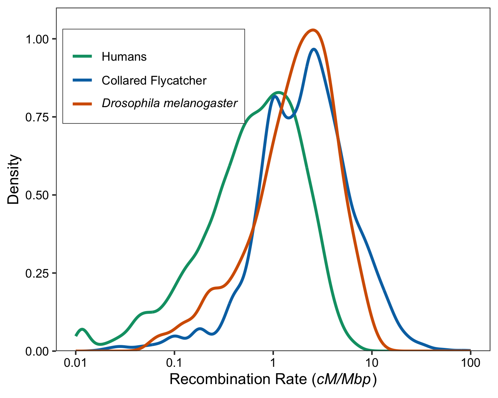

# Recombination rate variation and population genetic summary statistics

A repository containing the scripts and analysis results behind the manuscript "Variation in recombination affects detection of Fst outliers under neutrality". The manuscript is currently in review and we will deposit it on BioRXiv in the coming days.

There are two main parts to this repository:

 1. The sampling distribution of Fst calculated in analysis windows of fixed physical size for coalescent simulations of an island model - these simulations went into Figure 1 in the MS. There are also simulation results for demographies other than the island model we present in the manuscript. All the code and results shown in the paper are here: [CoalescentSimulations/](CoalescentSimulations/)

 2. Analysis of simulated and empirical *Drosophila melanogaster* datasets. These results went into Figure 2 of the paper. All the code to run the simulations and results needed to make the figures are here: [Drosophila/](Drosophila/)
 
Within each of the directories, you'll find all the code to run the simulations and data analysis that went into the paper, plus a few Bonus Features. 

The manuscript tex file is available too. [writeUp/](writeUp/)

## Motivation

This study was motivated by the following pattern:

The figure shows how variable recombination rates are across the genomes of three animal species that have been subject to genome scan studies. All three organsisms exhibit wide variation in recombination rate, over at least an order of magnitude. What we wanted to know was, does this variation in recombination rate affect the outcome of genome scans? Genome-scans are often used to find regions of the genome that have undergone or are currently undergoing selection. A typical analysis may divide the genome into analysis windows of a fixed physical size, calculate summary statistics within each of them and collate the genome-wide distribution for a particular summary statistic. One may then examine the tails of the genome-wide distribution of a summary statistic (often F_ST is used). However, our study shows that the sampling distribution of Fst is sensitive to variation in recombination rate, so low recombination regions may be enriched for high values of Fst and 

Check out the pre-print for a more complete picture, but the basic idea is this: Regions of the genome with low recombination rates will be underlain by few independant coalescent histories compared to more highly recombining reigons. When you average summary statstics across multiple SNPs in the low recombination case, the sampling distribution should have a higher variance than regions with high recombination. This difference means that there may be a greater 

We think that it does, and specifically that population genetic summary statistics calculated in regions of low recombination may have a different sampling distribution to statistics calculated in more highly recombining regions. 
